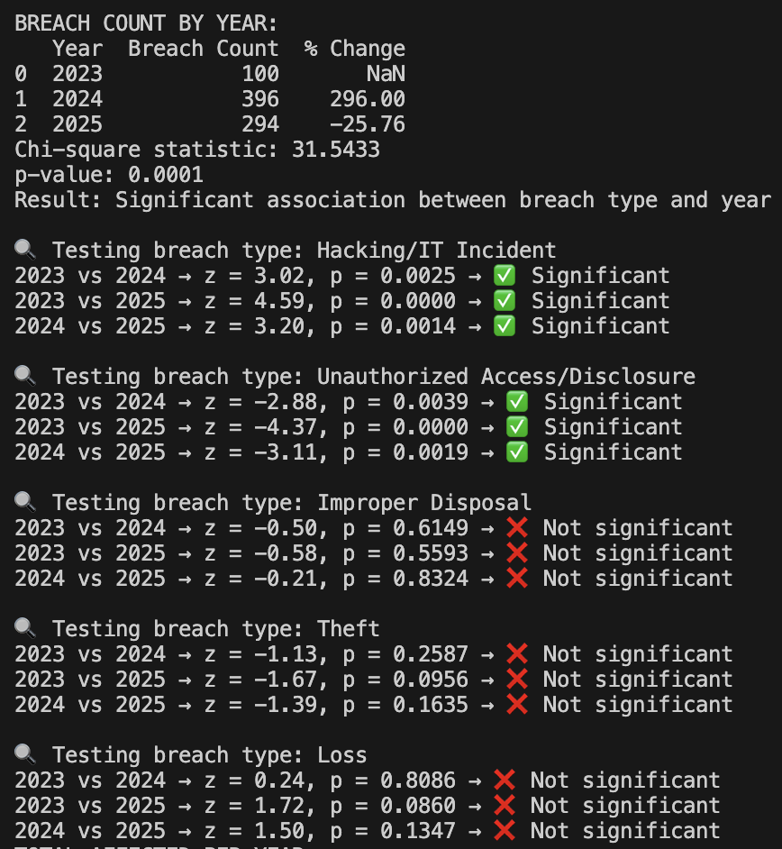
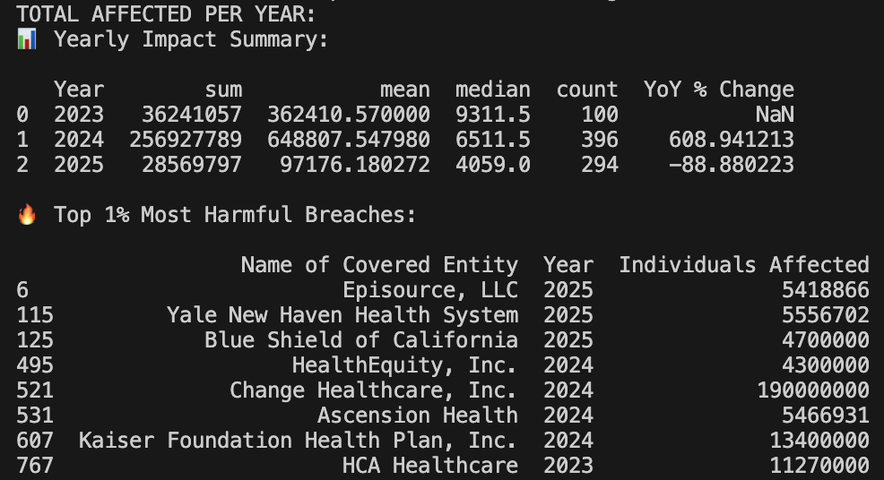
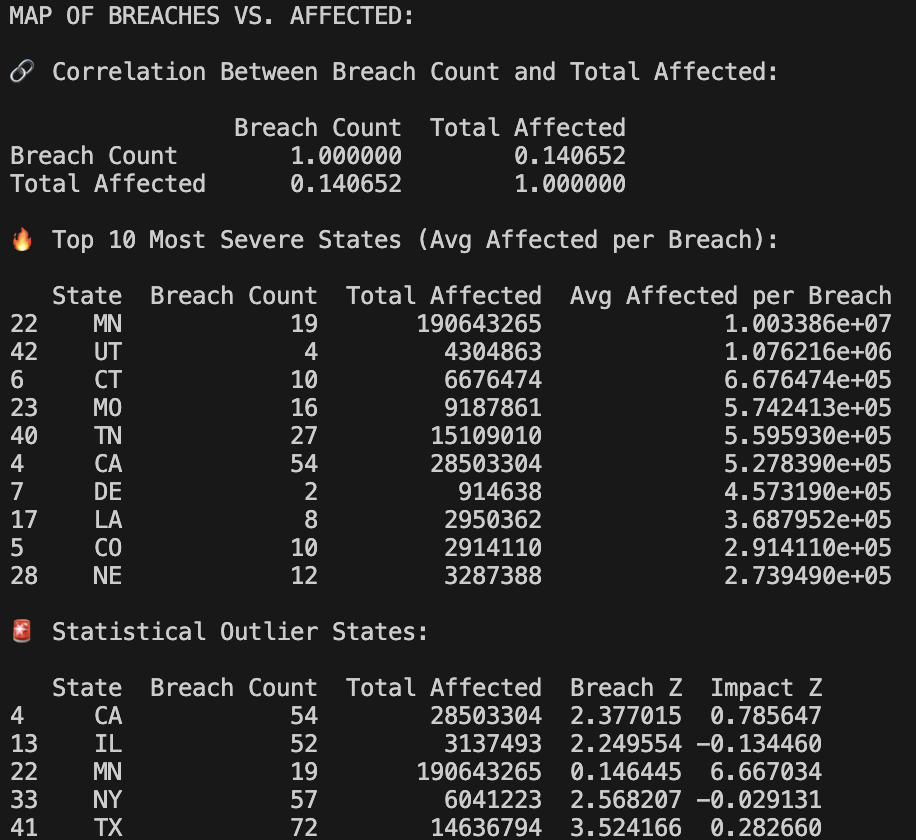
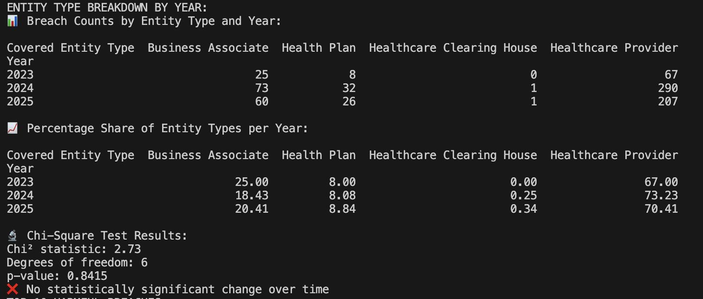
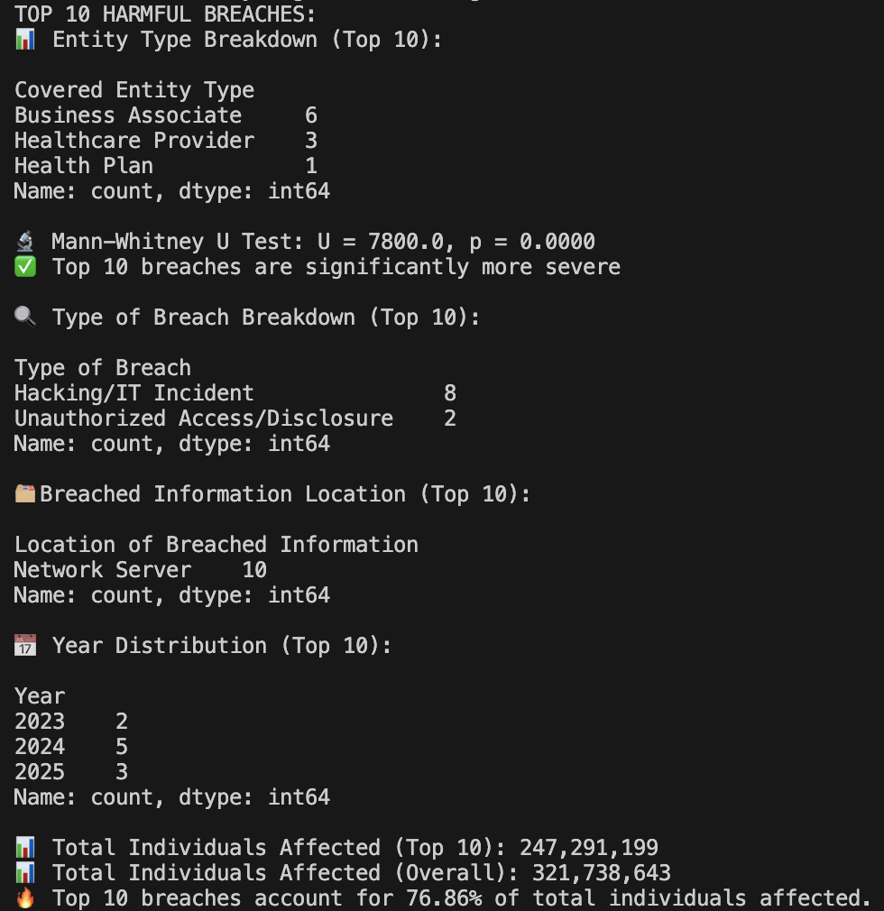

# U.S. Healthcare Data Breach Analysis (2023-2025)

## Project Overview
This project analyzes healthcare-related data breaches in the U.S. from 2023 to 2025 using Python for statistical analysis and Tableau for interactive visualization.

## Key Findings
List some of the key findings from this analysis

## Tableau Dashboard 

[Explore the Interactive Dashboard on Tableau Public!](https://public.tableau.com/views/USHealthcareDatabreachesVisualizations/Dashboard2)

## Python Analysis
## 1. Breach Count by Year 

### Breach Count by Year Python 

### Breach Count by Year Tableau

Actual chart or screenshot, link to tableau 

### Breach Count by Year Analysis
Between 2023 and 2025, there was significant fluctuation in the number of reported healthcare data breaches. In 2023, 100 breaches were reported, in 2024, this number almost quadrupled reaching 396 breaches (a 296% increase) before declining to 294 in 2025 (25.8% decrease). Despite this drop, breach levels in 2025 were almost triple as high as in 2023. 

A chi-square test of independence confirmed significant association between breach type and year (χ² = 31.54, p <0.001) which indicates that the distribution of breach types had meaningfully changed over time.

Looking at specific breach types, 
    - Hacking/IT Incidents showed significant increases over the years and were the most common breach type. 
    - Each pairwise comparison yielded statistically significatn results (all p < 0.01) over the years.
    - Unauthorized Access/Disclosure also showed significant increases over the years, following a similar patter to Hacking/IT Incidents.
    - Each pairwise comparison yielded statistically significatn results (all p <0.01) over the years.
    - Improper Disposal, Theft, and Loss did not show statistically significant changes across years (all p > 0.01), suggesting these breaches may be less volatile or requently reported.

These findings suggest that hacking and unauthorized access are becoming increasingly dominant and statistically distinguishable from other breach types within the healthcare spector. 

## 2. Total Affected per Year 

### Total Affected per Year Python

### Total Affected per Year Tableau

Actual chart or screenshot, link to tableau 

### Total Affected per Year Analysis

Within these three years, the total number of individuals affected by healthcare-related data breaches varied significantly. 2024 saw a large spike in the total number of indivduals affected, most likely driven by some extremely large data breaches including, Change Healthcare, Inc. (190 million) anf Kaiser Foundation Health Plan, Inc. (13.4 million). There appears to be high skewness in the data caused by massive outliers which is shown by the median in contrast to the mean. 

The top one percent of data breaches alone account for a majority of all indviduals affected in this time span. These breaches include Change Healthcare, Inc. (2024, 190 million), Kaiser Foundation (2024, 13.4 million), HCA Healthcare (2023, 11.2 million), Ascension Health (2024, 5.4 million), and Yale New Haven (2025, 5.5 million).

## 3. Map of Breaches vs. Affected 

### Map of Breaches vs. Affected Python

### Map of Breaches vs. Affected Tableau

Actual chart or screenshot, link to tableau

### Map of Breaches vs. Affected Analysis 

This interactive map is exploring the geographic dimension of breach incidents, allowing users to toggle between Breach Count and Total Indivduals Affected for each US state (with readily available data). Texas, New York, and California report the highest number of data breaches, at 72, 57, and 54 respectively. Minnesota has over 190 million indivduals affected, which was driven by a small number of high-severity data breaches. My correlation analysis shows a weak relationship (r = 0.14) between breach count and total affected per state, indicating that breach volume is not a reliable predictor of breach severity. These four mentioned states, along with Illinois, all appear to be statistical outliers. Minnesota has a breach count of 19, but high impact due to a few massive incidents, resulting in a Z-score of 6.67. California, Texas, and New York all have significantly above-average breach counts, with Z-Scores > 2.3, but a bit less extreme in individuals affected. Illinois, has a high breach count of 52 without a corresponding high impact, making it an interesting outlier in the opposite direction.

## 4. Entity Type Breakdown by Year

### Entity Type Breakhdown by Year Python

### Entity Type Breakdown by Year Tableau

Actual chart or screenshot, link to tableau

### Entity Type Breakdown by Year Analysis 

These findings tell us that Healthcare Providers consistently account for the majority of healthcare related data breaches, peaking in 2024 with 73.2% of data breaches. Business Associates shows some more fluctuation, raning between 18 and 25%. Health Plans and Healthcare Clearinghouses remain pretty low across all years. 

A chi-square test was run to assess whether the distribution of entity types changed signficantly over time. The results were χ² = 2.73, df = 6, and p = 0.8415 telling us that were no statistically significant changes, the proportional involvement of different entity types has remained fairly stable over these three years.   

## 5. Top 10 Harmful Breaches

### Top 10 Harmful Breaches Python

### Top 10 Harmful Breaches Tableau

Actual chart or screenshot, link to tableau

### Top 10 Harmful Breaches Analysis 

Here, I am highlighting the most impactful breaches by number of indviduals affected, offering insight into their characteristics, severity, and systemic patterns. There appears to be a disproportional impact where just ten breaches account for nearly 77% of all indviduals affected, showing the extreme skew of breach severity. A Mann-Whitney U test confirms a statistically significant difference (U = 7800.0, p < 0.0001), meaning the top ten breaches are significantly more severe than the rest. Eight out of ten breaches were due to Hacking/IT Incidents and ten out of ten were targeted at Network Servers, indicating a vulnerability in network infrastructure and highlights the importance of modernizing server security practices.

